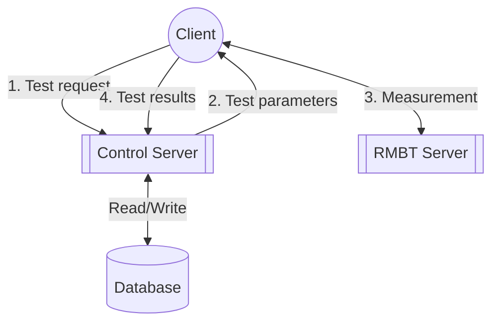
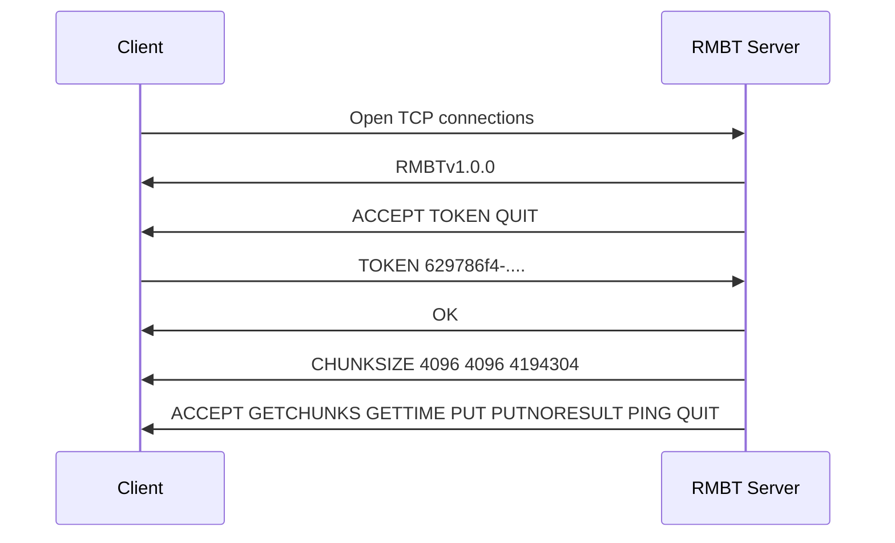
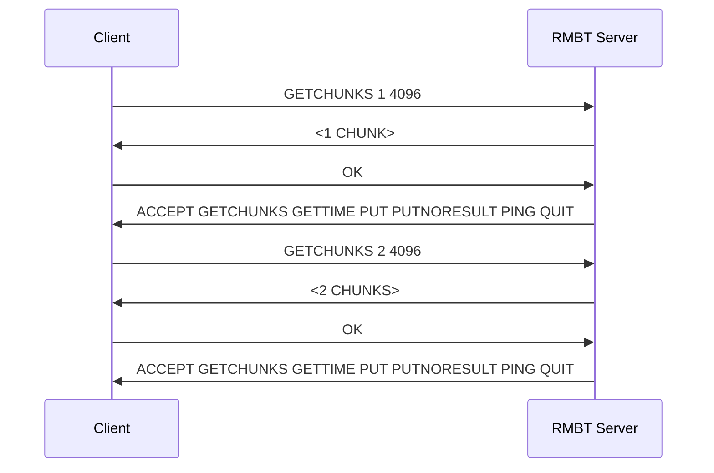
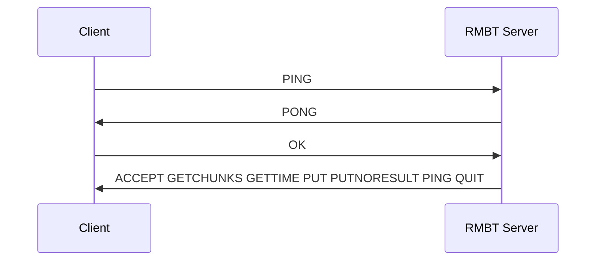
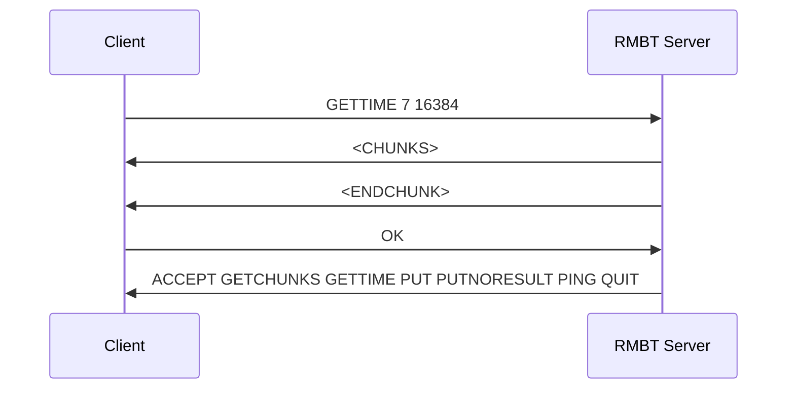
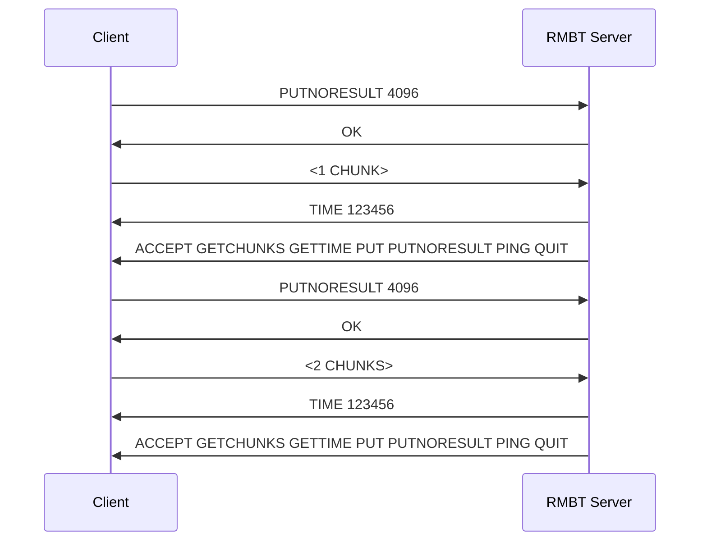
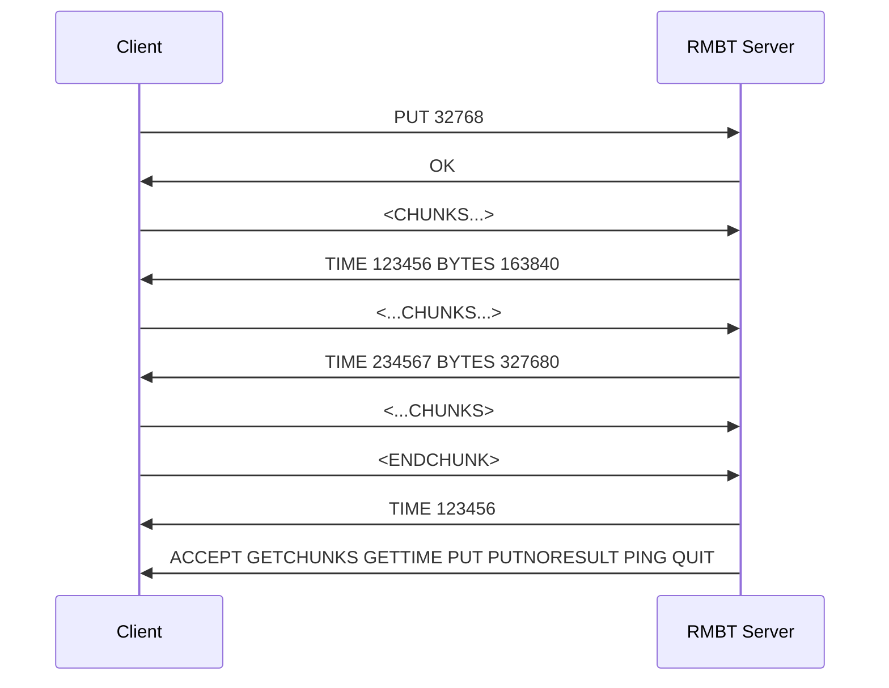
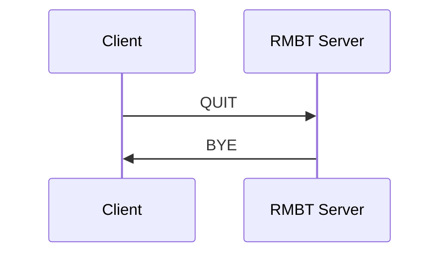
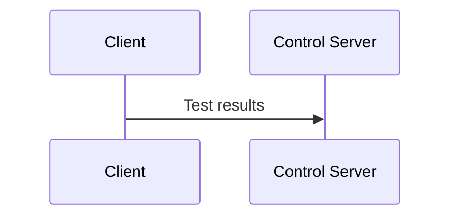

# RTR Multithreaded Broadband Test (RMBT): Specification

**Version 1.0.1, 27.05.2024** 

RTR-NetTest Team, E-mail: netztest@rtr.at, Web: https://www.netztest.at/

Austrian Regulatory Authority for Broadcasting and Telecommunications (Rundfunk und Telekom Regulierungs-GmbH; RTR)

Mariahilfer Straße 77–79, 1060 Vienna, Austria, Tel.: +43 1 58058-0, E-mail: rtr@rtr.at, Web: https://www.rtr.at/

## Preface
### Scope
The aim of this document is to specify an end-user oriented broadband test,
which measures the download and upload data rate as well as the latency of the Internet connection.
The document provides a brief overview of the test system and a detailed description of the test procedure.

This document only covers the parts of the system which are relevant for the said measurements.
Only the relevant parts of the Control Server are documented.
Other servers and other functions of the Control Server are out of scope of this document.

Sections [General requirements](#general-requirements) and [System components](#system-components) provide general information.
With sections [Global constants](#global-constants) and [Test procedure](#test-procedure) details of the RMBT are given.
Information regarding measurement data are provided in section [Measurement data](#measurement-data).
The communication protocol is specified in section [Communication protocol](#communication-protocol).
The section [Communication examples](#communication-examples) gives examples of the used protocol.

### Identification
The test specified in this document is identified as _RTR Multithreaded Broadband Test_ (abbr. _RMBT_).

### Open source
The implementation of this specification for the RTR-Netztest is provided as open source software. Please see https://www.netztest.at/ for details.

## General requirements
The test delivers an accurate measurement of the maximum bandwidth available over a given Internet connection.
This is achieved by transferring multiple parallel data streams over separate TCP connections within a predefined amount of time.

The transferred data consist of randomly generated data with high entropy.
It is not expected that the (pseudo) random number generator meets cryptographic requirements.
However it must effectively prohibit data compression during the transmission.

In order to increase the probability that the test can be performed even within networks protected by firewalls and proxy servers,
the data is transferred over a TLS[^1] connection.

The test may make use of HTTPS/Websocket[^2] connections.

## System components
The RMBT system is composed as follows:

_Figure: System overview_


By default, data is transferred between client and server over the TCP port 443 in order to avoid interference with firewalls as much as possible.
The ports for communication and data transfers between the different servers themselves are configurable. 

In general, the format of the transferred data is JSON[^3].
Only the RMBT Server uses a different protocol to keep the communication simple and therefore the workload of the client and the server at a minimum.

## Global constants
The following constants are used throughout the specification:

_Table: Constants_
|Constant|Description|Default|Unit
| :--- | :--- | ---: | :---
|$n_d$ |nominal number of parallel TCP connections used for **downlink** measurement ($n_d \geqslant 1$)|3 |(quantity)
|$n_u$ |nominal number of parallel TCP connections used for **uplink** measurement ($n_u \geqslant 1$) |3 |(quantity)
|$s_{min}$ |minimal size of a data chunk sent during the test |4096 |byte
|$s_{max}$ |maximum size of a data chunk sent during the test |4194304  |byte
|$s$ |size of data chunk sent during the test ($s_{min} \leqslant s \leqslant s_{max}$) |4096 |byte
|$d$ |nominal duration of pre-tests |2 |second
|$t$ |nominal duration of uplink and downlink measurements |7 |second
|$p$ |number of "pings" during latency test |10 |(quantity)
|$r$ |minimum interval between two consecutive statistical reports from the RMBT Server to the client when processing [PUT](#put-chunksize) |0.001 |second
|$w_1$ |wait constant 1 for [Phase 6: Uplink RMBT](#phase-6-uplink-rmbt)| 0.1 |second
|$w_2$ |wait constant 2 for [Phase 6: Uplink RMBT](#phase-6-uplink-rmbt)| 3 |second
|$w_3$ |wait constant 3 for [Phase 6: Uplink RMBT](#phase-6-uplink-rmbt)| 1 |second

## Test procedure
The test follows the procedure outlined below.
The test consists of seven phases which are carried out one after each other, i.e., phase $m$ starts after phase $m–1$ has finished.
That means that the phases do not overlap.

### Phase 1: Initialization
The RMBT Client tries to connect to the Control Server on the TCP port 443 using TLS.
In order to pass through certain firewalls, which might block unencrypted data transmissions, this might be necessary.

The server authentication key has a short length in order to reduce delays due to the TLS handshake.
TLS-security is not an objective.

After establishing a proper connection, client and server exchange the information, which is required for running the test.

The client sends a test request to the Control Server.
The Control Server determines the RMBT Server to be used.
It then generates a token consisting of the following components:

- a unique test ID (a UUID in accordance with[^4]),

- the time at which the measurement is allowed to start (a string representing Unix time) and

- the Base64-encoded HMAC-SHA-1 value[^5] of the string composed of the components mentioned above, where the components are separated by underscore characters. The HMAC value is computed using a key, which is only to be known to the RMBT and Control servers.

The time at which the measurement is allowed to start is included to allow congestion control. Normally the client will be allowed to start immediately. If the number of tests on an RMBT server is too high, the server may choose to permit the client at a later time. The server will allow the client to measure only in a specific window around the specified time. For details cf. section [TOKEN](#token-value).

The Control Server then transmits the token as well as all the additional test parameters (DNS name or IP address of the RMBT Server, number of parallel TCP connections, number of pings, test duration …) to the client.
The token is used for identifying the test session.

In Phase 1, the client opens $n:=n_d$ TCP connections to the assigned RMBT Server. The same token has to be submitted on each connection.

>[!NOTE] 
>For an example for phase 1 see [Example for phase 1](#example-for-phase-1)

### Phase 2: Downlink pre-test
The pre-test ensures that the Internet connection is in an "active" state, e.g. that dedicated radio resources are available (e.g. CELL_DCH state in UMTS or L0 state in DSL).
This makes the outcome of the test independent of the prior usage of the broadband access and thus leads to reproducible test results.
In addition the pre-test gives a rough estimate of the bandwidth.
If the estimate for the available bandwidth is very low, the test continues with 1 connection instead of $n$ (for details see below).

Within each of the $n$ TCP connections, the client requests and the server sends a data block of size $s$ (randomly generated data with high entropy, cf. section [General requirements](#general-requirements).

While the duration of the pre-test has not exceeded $d$, the client requests a data block of double size compared to the last iteration step.
The transfer of the last data block will be finished even if the duration has already exceeded $d$.

At the end of the pre-test, all TCP connections are left open for further use if more than four chunks have been transmitted in the downlink pre-test.
Otherwise, $n$ is reduced to 1 and all connections except one are terminated.

>[!NOTE]
>For an example for phase 2 see [Example for phase 2](#example-for-phase-2)

### Phase 3: Latency test
During this phase, the client sends $p$ "pings" in short intervals to the RMBT Server to test the latency of the connection.
One "ping" consists of the transmission of short strings via one of the TCP connections to the Server, which returns short strings as acknowledgement.
The other connections are idle during phase 3.

The client measures the time between sending and receiving the return message, while the server measures the time between sending its return message and the client's reception response.
The client stores all measurements, and the median of all server measurements is used as result.

>[!NOTE]
>For an example for phase 3 see [Example for phase 3](#example-for-phase-3)

### Phase 4: Downlink RMBT
Within each of the $n$ TCP connections opened during [phase 1](#phase-1-initialization) (which are still open after phase 2),
the client simultaneously requests and the server continuously sends data streams consisting of fixed-size chunks of size $s$
(randomly generated data with high entropy, cf. section [General requirements](#general-requirements)) for time $t$.

Let $`T := \{1, \dots, n\}`$ be the set of threads. 

$`\forall\:k\!\in\!T\!: t_k^{(0)}:=0 \land b_k^{(0)}:=0`$

All transmissions start at the same time, which is denoted as relative time $0$.
For each TCP connection $`k\!\in\!T`$, the client records the relative time $t_k^{(j)}$
and the total amount $b_k^{(j)}$ of data received on this connection from time $0$ to $t_k^{(j)}$
for successive values of $j$, starting with $j := 1$ for the first chunk received.
Let $m_k$ be the number of pairs $\Big(t_k^{(j)},b_k^{(j)}\Big)$ which have been recorded for TCP connection $k$.

After time $t$ the RMBT Server stops sending further chunks on all connections and sends a last chunk with the [termination_byte](#termination-byte) set.
If the client hasn't received the chunks with the termination bytes on all connections after time $t$, the client may choose to stop listening for further chunks and may terminate the connections.
(This might happen mainly because of a slow connection.)

Let $`t^* := \min\big(\{t_k^{(m_k)} | k\!\in\!T \}\big)`$ 

and $`\forall\:k\!\in\!T\!: l_k := \min\big(\{j\!\in\!\mathbb{N} \:|\: 1 \leqslant j \leqslant m_k \land t_k^{(j)} \geqslant t^* \}\big)`$

($l_k$ being the index of the chunk received on thread $k$ at $`t^*`$ or right after $`t^*`$)

Then the amount $b_k$ of data received over TCP connection $k$ from time $0$ to time $t^*$ is approximately

```math
b_k :\approx b_k^{(l_k-1)} + \frac{t^* - t_k^{(l_k-1)}}{t_k^{(l_k)} - t_k^{(l_k-1)}} (b_k^{(l_k)}-b_k^{(l_k-1)})
```

(For the thread $k$ where $t^* = t_k^{(m_k)} \implies l_k = m_k$ and therefore this simplifies to $b_k = b_k^{(m_k)}$.)

The data rate $R$ for all TCP connections together is
```math
R := \frac{1}{t^*} \sum_{k=1}^n b_k \approx \frac{1}{t^*} \sum_{k=1}^n \Bigg(b_k^{(l_k-1)} + \frac{t^* - t_k^{(l_k-1)}}{t_k^{(l_k)} - t_k^{(l_k-1)}} \; (b_k^{(l_k)}-b_k^{(l_k-1)})\Bigg).
```

This value is taken as an approximation of the download rate.

>[!NOTE]
>For an example for phase 4 see [Example for phase 4](#example-for-phase-4)

### Phase 5: Uplink pre-test
Phase 5 works analogous to [phase 2](#phase-2-downlink-pre-test), but with the client as sender. The rationale for the uplink pre-test is the same as for the downlink pre-test.

If the TCP connections were terminated in [phase 4](#phase-4-downlink-rmbt) the client opens $n:=n_u$ TCP connections to the assigned RMBT Server again, otherwise the still open connections are reused.
If $n$ was reduced to $1$ in phase 2, it may also be reduced to $1$ for the uplink measurements.

Within each TCP connection, the client sends a data block of size $s$ (randomly generated data with high entropy, cf. section [General requirements](#general-requirements)).

While the duration of the pre-test has not exceeded $d$, the client sends a data block of double size compared to the last iteration step.
The transfer of the last data block will be finished even if the duration has already exceeded $d$.
At the end of the pre-test, the TCP connections are left open for further use.

>[!NOTE]
>For an example for phase 5 see [Example for phase 5](#example-for-phase-5)

### Phase 6: Uplink RMBT
Phase 6 works analogous to [phase 4](#phase-4-downlink-rmbt), but this time the **client** is sending $s$ size chunks continuously to the server for time $t$.
The main difference is that in this case the server has to measure the time and reports the measurements back to the client.
This is done at a minimum interval of $r$.

Let $`T := \{1, \dots, n\}`$ be the set of threads.

$`\forall\:k\!\in\!T\!: t_k^{(0)}:=0 \land b_k^{(0)}:=0`$

All transmissions start at the same time, which is denoted as relative time $0$.
For each TCP connection $`k\!\in\!T`$, the server gives feedback to the client by sending the relative time
$t_k^{(j)}$ and the amount $b_k^{(j)}$ of data received from time $0$ to $t_k^{(j)}$
for successive values of $j$, starting with $j := 1$ for the first chunk received.
The feedback is sent immediately after a chunk has been received, but only if the last feedback was sent longer than $r$ ago. 

After time $t$ the client sends the last chunk (marked with the [termination byte](#termination-byte)) and stops sending further chunks on all connections.
The following takes place for each connection independently: The client now waits a fixed time of $w_1$ and checks if the feedback for all sent chunks has been received.
If feedback for some chunks is still missing (because of a slow connection) the client waits additionally a maximum of $w_2$ to receive at least all chunks where $t_k^{(j)} < t-w_3$.

For each $`k\!\in\!T`$, let $m_k$ be the number of pairs $\Big(t_k^{(j)},b_k^{(j)}\Big)$
which have been recorded for TCP connection $k$.

Let $`t^* := \min\big(\{t_k^{(m_k)} | k\!\in\!T \}\big)`$

and $`\forall\:k\!\in\!T\!: l_k := \min\big(\{j\!\in\!\mathbb{N} \:|\: 1 \leqslant j \leqslant m_k \land t_k^{(j)} \geqslant t^* \}\big)`$

Then the amount $b_k$ of data received over TCP connection $k$ from time $0$ to time $t^*$ is approximately

```math
b_k :\approx b_k^{(l_k-1)} + \frac{t^* - t_k^{(l_k-1)}}{t_k^{(l_k)} - t_k^{(l_k-1)}} (b_k^{(l_k)}-b_k^{(l_k-1)})
```

The data rate $R$ for all TCP connections together is
```math
R := \frac{1}{t^*} \sum_{k=1}^n b_k \approx \frac{1}{t^*} \sum_{k=1}^n \left(b_k^{(l_k-1)} + \frac{t^* - t_k^{(l_k-1)}}{t_k^{(l_k)} - t_k^{(l_k-1)}} \; (b_k^{(l_k)}-b_k^{(l_k-1)})\right).
```

This value is taken as an approximation of the upload rate.

>[!NOTE]
>For an example for phase 6 see [Example for phase 6](#example-for-phase-6)

### Phase 7: Finalization
After finishing all tests, the client sends the collected data to the Control Server.
All results collected on the client are transferred directly to the Control Server.
All tests, successful or unsuccessful, are stored by the Data Server.

>[!NOTE]
>For an example for phase 7 see [Example for phase 7](#example-for-phase-7)

## Measurement data
The following information is transmitted to the Control Server for each completed test:

- Latency
- Uplink data rate
- Downlink data rate
- Test UUID
- Date and time
- The number $n$ of concurrent TCP connections actually used
- (optionally) the individual tuples $\Big(t_k^{(j)},b_k^{(j)}\Big)$ measured during uplink and downlink measurement.
In order to keep the data size small, not all tuples might be transmitted.
In these cases an exact recalculation of the measured data rates based on the transmitted tuples might not be possible.

>[!NOTE]
>Further parameters might be collected and transmitted additionally to these information. These additional parameters are out of scope for this specification.

## Communication protocol

Data streams are sent using chunks of size $s$.
The initial [CHUNKSIZE](#chunksize-chunksize-chunksize_min-chunksize_max) is defined by the server during the handshake (e.g. 4096 bytes). The chunk size can be dynamically changed with the commands [GETCHUNKS](#getchunks-chunks-chunksize), [GETTIME](#gettime-duration-chunksize), [PUT](#put-chunksize) and [PUTNORESULT](#putnoresult-chunksize).

### Termination byte
The last byte of each chunk is used to signal the receiving side if another chunk will follow.
The last byte is set to a byte with all bits set to 0 (i.e. 0x00) for all but the last chunks.
The last chunk has a last byte with all bits set to 1 (i.e. 0xFF).

This definition is valid for the data streams following the commands [GETCHUNKS](#getchunks-chunks-chunksize), [GETTIME](#gettime-duration-chunksize), [PUT](#put-chunksize) and [PUTNORESULT](#putnoresult-chunksize).

### Client

#### TOKEN \<VALUE\>
Before the client is authorized to perform any measurements it has provide the server with a token which is generated by the Control Server and transmitted to the client.
The client transmits the verification token, which contains the necessary values for running the test.
The token is constructed as follows: \<<UUID\>\_\<TIMESTAMP>\_\<HMAC>> (the right and left angle brackets are not part of the token).

- UUID: the test UUID generated by the Control Server for each test
- TIMESTAMP: standard Unix timestamp of the earliest allowed start time of the test
- HMAC: base64 coded HMAC-SHA1 value of \<UUID>\_\<TIMESTAMP>

The HMAC is calulated using a shared secret between the Control Server and the RMBT server.
If the HMAC is invalid the server immediately terminates the connection.
Also if the token is syntactically invalid the connection is terminated.

The client is only accepted if the current time is in a defined window depending on the timestamp in the token.
If the client is early, but in the defined window, the server sleeps until the time is reached.
If the client is at the time or late, but in the defined window, the client is allowed to start measuring immediately.
The current server configuration used a window of 20 seconds early, 90 seconds late.

#### PING
The server is expected to reply immediately with a [PONG](#pong).

#### GETTIME \<DURATION\> \<CHUNKSIZE\>
The client requests a data stream from the RMBT Server with a duration of \<DURATION> seconds consisting of chunks of the previously specified size $s$ or the size optionally given in the \<CHUNKSIZE> argument.
The server responds by sending the data stream.
The data stream ends after \<DURATION> seconds have passed on the server side.
After the client received the last chunk, marked by the [termination byte](#termination-byte), the client sends an OK to the server.

#### GETCHUNKS \<CHUNKS\> \<CHUNKSIZE\>
The client requests a data stream from the RMBT Server, consisting of \<CHUNKS> chunks of the previously specified size $s$ or the size optionally given in the \<CHUNKSIZE> argument.
The last byte will be marked with the [termination byte](#termination-byte).
After all chunks have been received by the client, the client is expected to send an OK to the server.

#### PUT \<CHUNKSIZE\>
The client requests to send a data stream to the RMBT Server consisting of chunks of the previously specified size $s$ or the size optionally given in the \<CHUNKSIZE> argument.
The server responds with [OK](#ok).
The data stream ends with a [termination byte](#termination-byte) on the last position of the transmitted chunks in the data stream.
After a chunk has been received - but only if the time $r$ has passed since the last sending - the server sends a [TIME \<t> BYTES \<b>](#time-t-bytes-b) back to the client,
telling the client

- \<t>: the number of nanoseconds passed since it has received the PUT,
- and \<b>: the number of bytes received.

The last chunk is signaled with a termination byte by the client.
After the server received the last chunk it responds with a [TIME \<t>](#time-t).

#### PUTNORESULT \<CHUNKSIZE\>
Works identical to [PUT](#put-chunksize), but the server sends no intermediate [TIME \<t> BYTES \<b>](#time-t-bytes-b) results. The  [TIME \<t>](#time-t) is sent nevertheless.

#### OK
OK is the client's response to a successfully received transmission from the RMBT server.
The transmission can either be a [PONG](#pong) or a data stream initiated by [GETCHUNKS](#getchunks-chunks-chunksize) or [GETTIME](#gettime-duration-chunksize).

#### ERR
ERR is the client's response to any unsuccessful request.

#### QUIT
With QUIT the client requests to quit the test. The server responds with a [BYE](#bye) and immediately closes the connection thereafter.

### Server

#### \<VERSION\>
\<VERSION> is the version of the running server as string, e.g. "RMBTv1.0.0".

#### ACCEPT \<VALUES\>
ACCEPT \<VALUES> is the list of procedures currently allowed or expected by the server.
Possible values are [TOKEN](#token-value), [GETCHUNKS](#getchunks-chunks-chunksize), [GETTIME](#gettime-duration-chunksize), [PUT](#put-chunksize), [PUTNORESULT](#putnoresult-chunksize), [PING](#ping) and [QUIT](#quit), in no specific order and separated from each other by space characters.

#### CHUNKSIZE \<CHUNKSIZE\> \<CHUNKSIZE_MIN\> \<CHUNKSIZE_MAX\>
The server defines the used chunk-size (size $s$ of initial data block) and chunk-size range in bytes (octets).

#### PONG
PONG is the answer to a [PING](#ping) from the client.
The client responds with [OK](#ok).

#### TIME \<t\>
The number of nanoseconds \<t> passed since the beginning of the measurement. See [PUT](#put-chunksize) and [PUTNORESULT](#putnoresult-chunksize).

#### TIME \<t\> BYTES \<b\>
The number of nanoseconds \<t>, and the number of bytes \<b> received since the beginning of the current measurement. See [PUT](#put-chunksize).

#### OK
OK is the server's regular response to [TOKEN](#token-value), [PUT](#put-chunksize) and [PUTNORESULT](#putnoresult-chunksize).

#### ERR
ERR is the server's response to any unsuccessful request.

#### BYE
BYE is the server's regular response to [QUIT](#quit).
The server closes the connection right after responding.

## Communication examples

- _\<n CHUNK(S)>_ denotes the sending of n chunks of _CHUNKSIZE_ with the [Termination byte](#termination-byte) set to 0x00.
- _\<CHUNKS>_ denotes the sending of multiple chunks of _CHUNKSIZE_ with the termination byte set to 0x00 until the desired time is reached. 
  Dots (...) before _CHUNKS_ denote that the chunks are sent concurrently and independent of the communication in the other direction.
- _\<ENDCHUNK>_ denotes the sending of 1 chunk with the termination byte set to 0xFF

### Example for phase 1

_Figure: Communcation example between client and Control Server for phase 1_


_Figure: Communication example for [Phase 1: Initialization](#phase-1-initialization)_


### Example for phase 2

_Figure: Communication example for [Phase 2: Downlink pre-test](#phase-2-downlink-pre-test)_


### Example for phase 3

_Figure: Communication example for [Phase 3: Latency test](#phase-3-latency-test)_


### Example for phase 4

_Figure: Communication example for [Phase 4: Downlink RMBT](#phase-4-downlink-rmbt)_


### Example for phase 5

_Figure: Communication example for [Phase 5: Uplink pre-test](#phase-5-uplink-pre-test)_


### Example for phase 6

_Figure: Communication example for [Phase 6: Uplink RMBT](#phase-6-uplink-rmbt)_


### Example for phase 7

_Figure: Communication example for [Phase 7: Finalization](#phase-7-finalization)_


_Figure: Communcation example between client and Control Server for phase 7_


## Change history

|Version |Date |Comment
| :-- | :-- | :--
|1.0.1|27.05.2024|- Conversion from AsciiDoc into GitHub Flavored Markdown (GFM) with minor editorial changes
|1.0.0|22.06.2017|- Support for dynamic chunk sizes<br>- Published under https://www.netztest.at/doc/
|0.8.0|16.10.2015|- First HTML version<br>- Updates and clarifications, mainly for formulas and communication examples<br>- System overview figure updated for functionality<br>- Minor refinements and error corrections<br>- Change history added

## Footnotes
[^1]: Dierks, T. and E. Rescorla, “The Transport Layer Security (TLS) Protocol Version 1.2”, RFC 5246, DOI 10.17487/RFC5246, August 2008, http://www.rfc-editor.org/info/rfc5246.
[^2]: Fette, I. and A. Melnikov, “The WebSocket Protocol”, RFC 6455, DOI 10.17487/RFC6455, December 2011, http://www.rfc-editor.org/info/rfc6455.
[^3]: Bray, T., Ed., “The JavaScript Object Notation (JSON) Data Interchange Format”, RFC 7159, DOI 10.17487/RFC7159, March 2014, http://www.rfc-editor.org/info/rfc7159.
[^4]: Leach, P., Mealling, M., and R. Salz, “A Universally Unique IDentifier (UUID) URN Namespace”, RFC 4122, DOI 10.17487/RFC4122, July 2005, http://www.rfc-editor.org/info/rfc4122.
[^5]: Krawczyk, H., Bellare, M., and R. Canetti, “HMAC: Keyed-Hashing for Message Authentication”, RFC 2104, DOI 10.17487/RFC2104, February 1997, http://www.rfc-editor.org/info/rfc2104.
